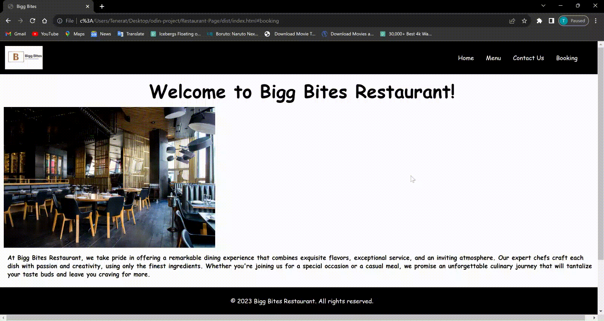

# Restaurant-Page

This project is designed to showcase my proficiency with webpack and web development technologies. The website currently contains food menus, a contact page, and a reservation feature. It's a work in progress, and more features are planned for the future, including aesthetics improvements and additional interactive features.

## Demo 

## Table of Contents
- [Project Overview](#project-overview)
- [Technologies Used](#technologies-used)
- [Features](#features)
- [Future Enhancements](#future-enhancements)

---

## Project Overview

This project is a restaurant website aimed at providing essential information to potential customers. It currently includes three main sections:

1. **Food Menus:** This section displays delicious menu items, complete with descriptions and prices. Customers can browse through our offerings to decide what they'd like to order.

2. **Contact Page:** This page provides the restaurant's contact information, including the address, phone number, and email. Customers can use this information to get in touch with us or find our physical location.

3. **Reservation Feature:** Our reservation feature allows customers to make a reservation for a table at our restaurant. They can choose the date, time, number of guests, and provide any special requests or preferences.

## Technologies Used

The project leverages several technologies to create a seamless user experience:

- **Webpack:** Webpack is used for bundling and managing assets, making our website more efficient and faster to load.

- **HTML/CSS:** The foundation of our website, HTML for structure and CSS for styling.

- **JavaScript:** To add interactivity and functionality to our website, including form validation for reservations.

- **Future Enhancements:** As mentioned earlier, I plan to incorporate additional technologies for aesthetics improvements, such as CSS frameworks or libraries, and more interactive features, which may involve JavaScript libraries or frameworks.

## Features

The current features of the restaurant website include:

- **Food Menus:** Browse through our menu items, view descriptions, and prices.

- **Contact Page:** Find our contact details and get in touch with us.

- **Reservation Feature:** Make a reservation for a table at our restaurant, specifying date, time, and number of guests.

## Future Enhancements

I have exciting plans for the future of this project, including:

- **Aesthetics Improvements:** I'll be enhancing the visual appeal of my website using CSS frameworks or custom styling to create a more visually engaging experience.

- **Additional Interactive Features:** Expect more interactive elements like image galleries, customer reviews, and perhaps an online ordering system.

- **Performance Optimization:** Ongoing efforts to optimize the website for faster loading times and improved user experience.

## How to Use

To run this project locally and explore its features, follow these steps:

1. Clone this repository to your local machine.
2. Navigate to the project folder using your command line or terminal.
3. Install the necessary dependencies using a package manager (e.g., npm).
4. Use webpack to build the project: `npm run build`.
5. Open the generated HTML file in your web browser.

Feel free to explore the code and make improvements as needed for your assessment.

## Contributing

I welcome contributions to this project. If you have ideas for new features, improvements, or bug fixes, please open an issue or submit a pull request. I value your input and collaboration!
